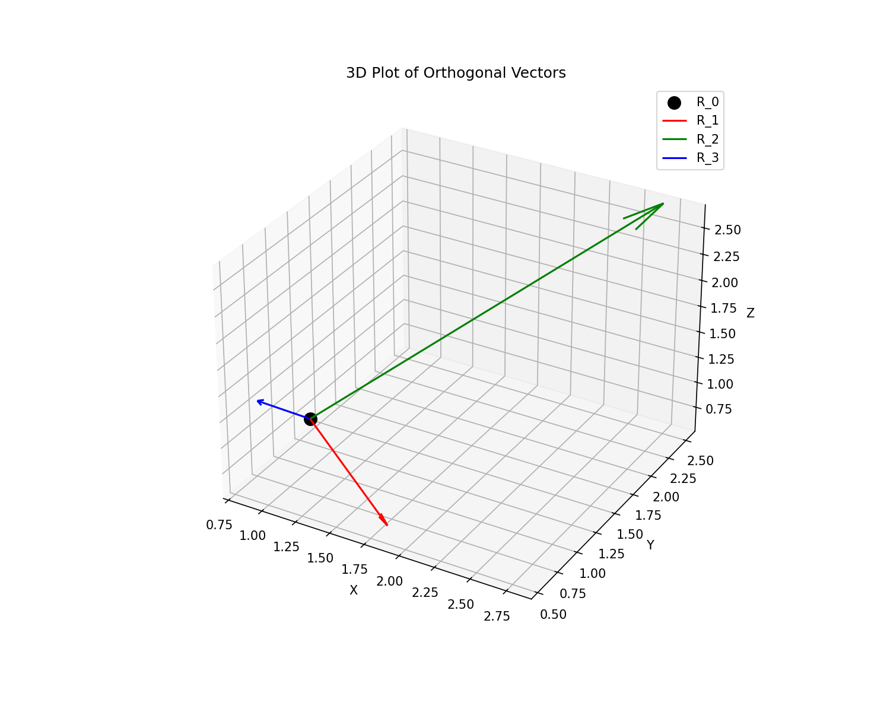

# Orthogonal Vectors Generator and Visualizer

This project creates and visualizes three orthogonal vectors from a given origin point.

## Project Structure

The project has two implementations:

1. **Basic Implementation** - The original implementation in the root directory
2. **Generalized Implementation** - A more modular and configurable implementation in the `generalized` directory

## Requirements

- Python 3.6+
- numpy
- matplotlib

## Setup

1. Create a virtual environment:
   ```
   python -m venv venv
   ```

2. Activate the virtual environment:
   - On Linux/Mac:
     ```
     source venv/bin/activate
     ```
   - On Windows:
     ```
     venv\Scripts\activate
     ```

3. Install the required packages:
   ```
   pip install -r requirements.txt
   ```

## Basic Implementation

### Usage

Run the main script:
```
python main.py
```

This will:
1. Generate three orthogonal vectors from the origin (0,0,0)
2. Display a 3D plot of these vectors
3. Show 2D projections of these vectors on the XY, XZ, and YZ planes

### Customization

You can modify the parameters in the `main()` function of `main.py` to change:
- The origin point (`R_0`)
- The distance parameter (`d`)
- The angle parameter (`theta`)

## Generalized Implementation

The generalized implementation provides a more modular and configurable approach to vector generation and visualization.

### Features

- Modular architecture with separate components for vector calculations, visualization, and configuration
- Enhanced visualization with color-coded axes, coordinate labels, and data-driven scaling
- Perfect orthogonal circle generation in the plane orthogonal to the x=y=z line
- Command-line interface with various options for customization
- Configuration management with JSON file support
- Ability to save plots to files
- Example scripts demonstrating different use cases

### Usage

#### Basic Usage

```bash
cd generalized
python main.py
```

This will generate orthogonal vectors with default parameters and display the plots.

#### Command-line Options

```bash
cd generalized
python main.py --origin 1 1 1 --distance 2 --angle 1.047
```

This will generate orthogonal vectors with the specified origin (1,1,1), distance (2), and angle (π/3 radians).

#### Saving Plots

```bash
cd generalized
python main.py --save-plots --output-dir my_plots
```

This will save the plots to the `my_plots` directory instead of displaying them.

#### Configuration Files

```bash
cd generalized
# Save configuration to a file
python main.py --save-config my_config.json

# Load configuration from a file
python main.py --config my_config.json
```

### Example Results

#### Default Configuration (Origin at [0,0,0], d=1, theta=π/4)

3D Visualization:


#### Custom Configuration (Origin at [1,1,1], d=2, theta=π/3)

3D Visualization:



### Documentation

For more detailed documentation, see the [generalized implementation documentation](generalized/docs/documentation.md).

## Enhanced Visualization Features

The latest version includes several visualization enhancements for improved clarity and spatial understanding:

- **Color-coded Axes**: The X (red), Y (green), and Z (blue) axes are color-coded for easy identification
- **Coordinate Labels**: Integer coordinate values are displayed along each axis, color-matched to the axis color
- **Tick Marks**: Small tick marks along each axis for better spatial reference
- **Data-driven Scaling**: The axis limits are dynamically adjusted based on the actual data points
- **Equal Aspect Ratio**: The 3D plots maintain an equal aspect ratio for accurate spatial representation

These enhancements significantly improve the visual representation of the orthogonal vectors, making it easier to understand their spatial relationships and properties.

### Example of Enhanced Visualization


The image above shows multiple perfect orthogonal circles with different distances, demonstrating the enhanced visualization features including color-coded axes, coordinate labels, and data-driven scaling.
