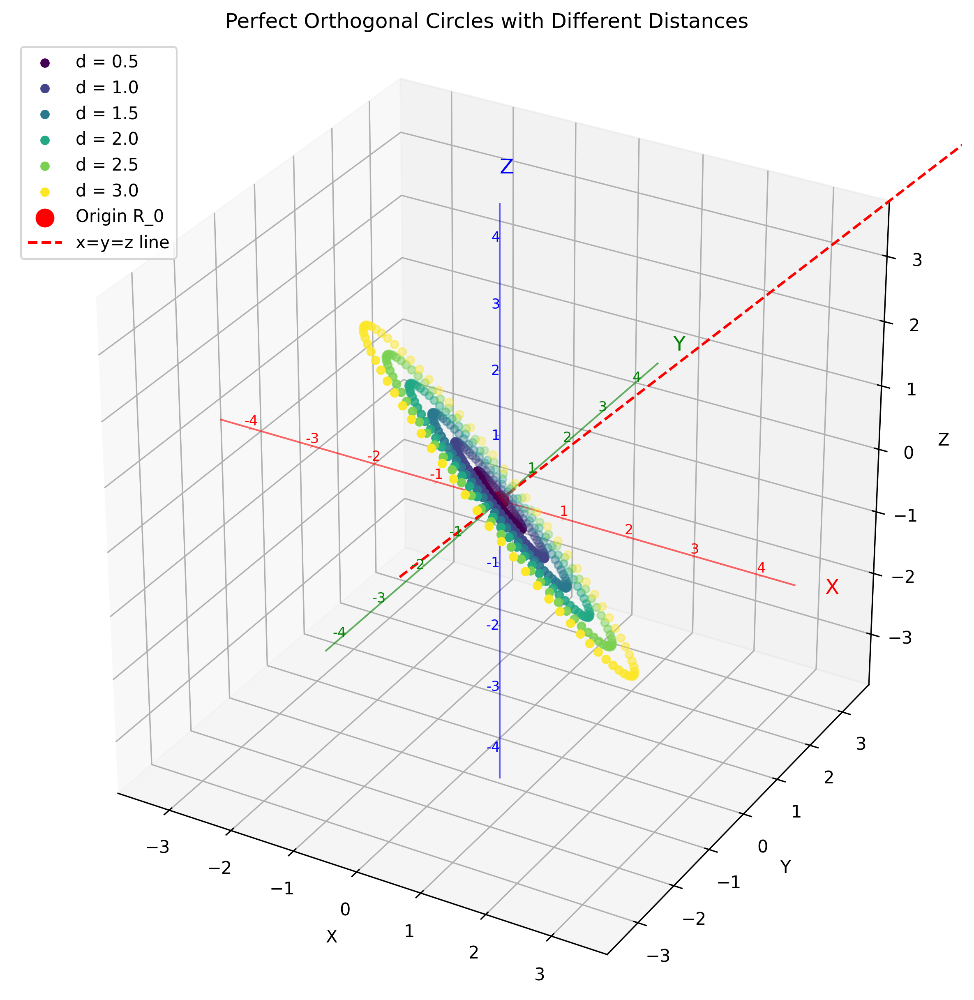

# Arrowhead Matrix and Berry Phase Calculation
# Important note: This project is deprecated
# use only the generalized folder if cloning to generate the vectors:D
This project implements and optimizes Arrowhead matrix generation and Berry phase calculations for quantum systems.

## Project Structure

The project has several key components:

1. **Basic Implementation** - The original implementation in the root directory
2. **Generalized Implementation** - A more modular and configurable implementation in the `generalized` directory
3. **Berry Phase Calculation** - Improved algorithms for calculating Berry phases with eigenstate tracking
4. **Parameter Optimization** - Tools for optimizing VA potential parameters to minimize parity flips

## Requirements

- Python 3.6+
- numpy
- matplotlib

## Parameter Optimization

The project includes several scripts for optimizing the parameters of the VA potential to minimize parity flips in eigenstate 3:

### Key Scripts

- `run_arrowhead_simulation.py` - Main script for running simulations with configurable parameters
- `run_improved_berry_phase.py` - Script for calculating Berry phases with improved eigenstate tracking
- `parameter_analysis.py` - Script for systematically exploring parameter combinations
- `focused_parameter_analysis.py` - Script for fine-tuning parameters in a narrow range
- `run_zero_flip_simulation.py` - Script for running a simulation with the optimal parameters
- `run_optimal_visualization.py` - Script for generating comprehensive visualizations of Berry phases, eigenstate behavior, and parity flips using the optimal parameters
- `plot_phase_transitions.py` - Script for visualizing topological phase transitions across parameter sweeps
- `run_parameter_sweep.py` - Script for running simulations with different parameter values to collect data for phase transition analysis

### Optimal Parameters

Through systematic parameter exploration, we found configurations that achieve 0 parity flips in eigenstate 3:

```
x_shift: 22.5
y_shift: 547.7222222222222
d_param: 0.005
omega: 0.025
a_vx: 0.018
a_va: 0.42
```

Detailed results and visualizations are stored in the `parameter_analysis` directory.

## Berry Phase Visualization and Topological Phase Transitions

The project includes advanced tools for visualizing Berry phases and analyzing topological phase transitions:

### Berry Phase Visualization

The `run_optimal_visualization.py` script generates comprehensive visualizations of Berry phases, eigenstate behavior, and parity flips using the optimal parameters. Key features include:

- **Berry Phase Table**: Displays raw phases, winding numbers, normalized and quantized phases for each eigenstate
- **Half-Integer Winding Numbers**: Correctly identifies and displays half-integer winding numbers (-0.5) for eigenstate 2, which is physically significant for topological systems
- **Parity Flip Analysis**: Detailed analysis of parity flips for each eigenstate
- **Eigenstate Visualization**: Plots showing eigenstate behavior as a function of θ
- **Degeneracy Analysis**: Analysis of eigenstate degeneracy and crossings

All visualizations are saved to the `optimal_visualization` directory, with a comprehensive summary in `summary.txt`.

### Topological Phase Transitions

The project includes tools for analyzing topological phase transitions as system parameters are varied:

- `run_parameter_sweep.py`: Runs simulations with different parameter values (e.g., y_shift) to collect data across phase transitions
- `plot_phase_transitions.py`: Creates visualizations showing how Berry phases and winding numbers change across parameter values, highlighting transition regions

These tools enable the identification and analysis of topological phase transitions, which are characterized by changes in winding numbers and correspond to fundamental changes in the system's topological properties.

Visualizations of phase transitions are saved to the `phase_transition_plots` directory.

## Setup

1. Create a virtual environment:
   ```
   python -m venv venv
   ```

2. Activate the virtual environment:
   - On Linux/Mac:
     ```
     source venv/bin/activate
     ```
   - On Windows:
     ```
     venv\Scripts\activate
     ```

3. Install the required packages:
   ```
   pip install -r requirements.txt
   ```

## Basic Implementation

### Usage

Run the main script:
```
python main.py
```

This will:
1. Generate three orthogonal vectors from the origin (0,0,0)
2. Display a 3D plot of these vectors
3. Show 2D projections of these vectors on the XY, XZ, and YZ planes

### Customization

You can modify the parameters in the `main()` function of `main.py` to change:
- The origin point (`R_0`)
- The distance parameter (`d`)
- The angle parameter (`theta`)

## Generalized Implementation

The generalized implementation provides a more modular and configurable approach to vector generation and visualization.

### Features

- Modular architecture with separate components for vector calculations, visualization, and configuration
- Enhanced visualization with color-coded axes, coordinate labels, and data-driven scaling
- Perfect orthogonal circle generation in the plane orthogonal to the x=y=z line
- Command-line interface with various options for customization
- Configuration management with JSON file support
- Ability to save plots to files
- Example scripts demonstrating different use cases

### Usage

#### Basic Usage

```bash
cd generalized
python main.py
```

This will generate orthogonal vectors with default parameters and display the plots.

#### Command-line Options

```bash
cd generalized
python main.py --origin 1 1 1 --distance 2 --angle 1.047
```

This will generate orthogonal vectors with the specified origin (1,1,1), distance (2), and angle (π/3 radians).

#### Saving Plots

```bash
cd generalized
python main.py --save-plots --output-dir my_plots
```

This will save the plots to the `my_plots` directory instead of displaying them.

#### Configuration Files

```bash
cd generalized
# Save configuration to a file
python main.py --save-config my_config.json

# Load configuration from a file
python main.py --config my_config.json
```

### Example Results

#### Default Configuration (Origin at [0,0,0], d=1, theta=π/4)

3D Visualization:


#### Custom Configuration (Origin at [1,1,1], d=2, theta=π/3)

3D Visualization:


### Documentation

For more detailed documentation, see the [generalized implementation documentation](generalized/docs/documentation.md).

## Enhanced Visualization Features

The latest version includes several visualization enhancements for improved clarity and spatial understanding:

- **Color-coded Axes**: The X (red), Y (green), and Z (blue) axes are color-coded for easy identification
- **Coordinate Labels**: Integer coordinate values are displayed along each axis, color-matched to the axis color
- **Tick Marks**: Small tick marks along each axis for better spatial reference
- **Data-driven Scaling**: The axis limits are dynamically adjusted based on the actual data points
- **Equal Aspect Ratio**: The 3D plots maintain an equal aspect ratio for accurate spatial representation

These enhancements significantly improve the visual representation of the orthogonal vectors, making it easier to understand their spatial relationships and properties.

### Example of Enhanced Visualization



The image above shows multiple perfect orthogonal circles with different distances, demonstrating the enhanced visualization features including color-coded axes, coordinate labels, and data-driven scaling.
