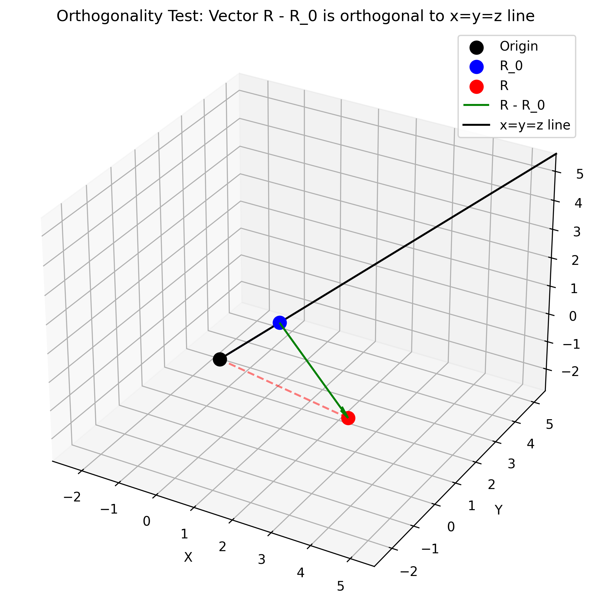
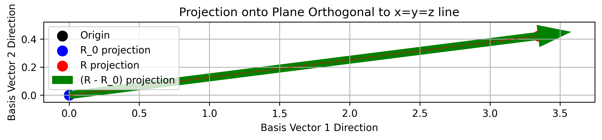
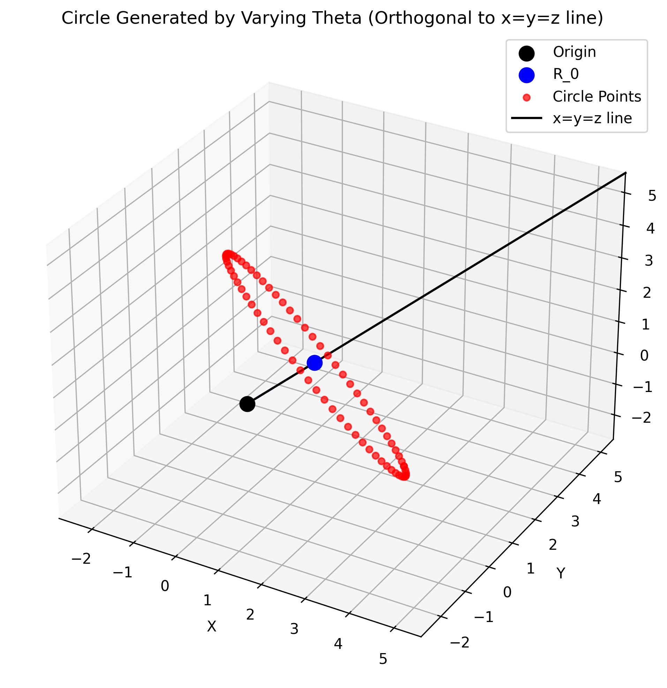
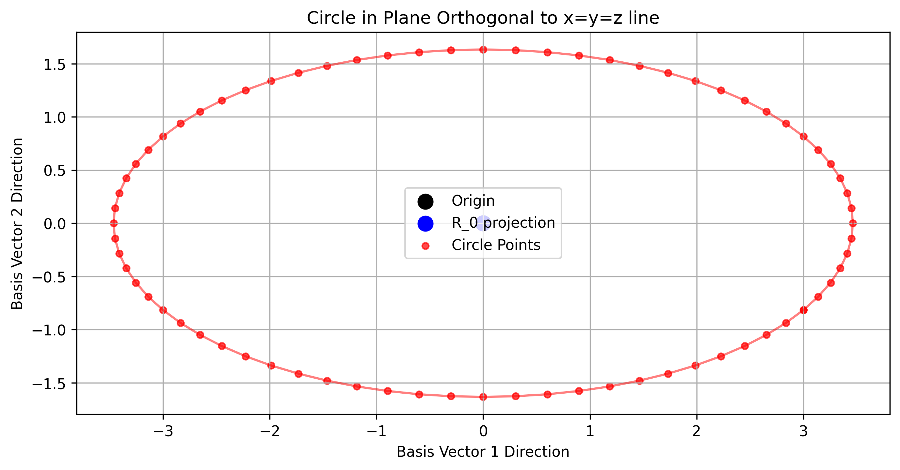

# Orthogonality Test Report

This report documents the testing of the vector generation implementation that ensures orthogonality to the x=y=z line.

## Test Parameters

- Origin vector (R_0): [1, 1, 1]
- Distance parameter (d): 2.0
- Angle parameter (theta): π/4 (45 degrees)

## Implementation Details

The implementation uses two basis vectors that are orthogonal to the (1,1,1) direction:
- Basis vector 1: [1, -1/2, -1/2]
- Basis vector 2: [0, -1/2, 1/2]

These basis vectors form a basis for the plane orthogonal to the x=y=z line. Any linear combination of these vectors will also be orthogonal to this line.

## Test Results

### Vector Generation

- Generated vector (R): [3.73205081, -0.66488389, -0.06716691]
- Displacement vector (R - R_0): [2.73205081, -1.66488389, -1.06716691]

### Orthogonality Verification

- Dot product with normalized (1,1,1) direction: -1.11e-16
- This value is effectively zero (within floating-point precision), confirming orthogonality

### Component Analysis

The displacement vector is composed of three components:
- Component 1: [1.15470054, -0.57735027, -0.57735027]
- Component 2: [1.57735027, -0.78867513, -0.78867513]
- Component 3: [0.0, -0.29885849, 0.29885849]

Each component is constructed using the basis vectors to ensure orthogonality to the x=y=z line.

## Visualizations

### 3D Visualization of Single Vector

This visualization shows:
- The origin (black)
- The origin vector R_0 (blue)
- The generated vector R (red)
- The displacement vector R - R_0 (green arrow)
- The x=y=z line (black line)

The displacement vector is orthogonal to the x=y=z line, as verified by the dot product calculation.

### 2D Projection onto Orthogonal Plane

This visualization shows the projection of vectors onto the plane orthogonal to the x=y=z line:
- The origin (black)
- The projection of R_0 (blue)
- The projection of R (red)
- The projection of the displacement vector (green arrow)

### Circle Generation by Varying Theta (3D)

This visualization shows:
- The origin (black)
- The origin vector R_0 (blue)
- Points generated by varying theta from 0 to 2π (red points)
- The x=y=z line (black line)

All generated points form a circle that lies in a plane orthogonal to the x=y=z line.

### Circle in Orthogonal Plane (2D)

This visualization shows the projection of the circle onto the plane orthogonal to the x=y=z line:
- The origin (black)
- The projection of R_0 (blue)
- The projected circle points (red)

The perfect circular shape confirms that the vector generation correctly traces a circle in the plane orthogonal to the x=y=z line.

## Conclusion

The test confirms that:

1. The implementation correctly generates vectors that are orthogonal to the x=y=z line
2. The orthogonality is maintained regardless of the value of theta
3. When theta is varied from 0 to 2π, the resulting vectors form a circle in the plane orthogonal to the x=y=z line
4. The basis vectors [1, -1/2, -1/2] and [0, -1/2, 1/2] provide a correct basis for generating vectors orthogonal to the (1,1,1) direction

The implementation successfully achieves the goal of generating vectors orthogonal to the x=y=z line using the specified basis vectors.
